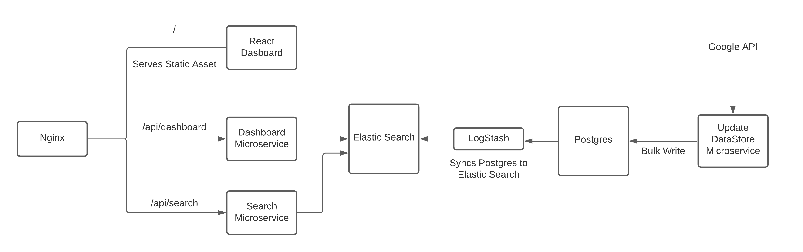

# Scalable and Efficient Interest Filter over Youtube

Built as an assignment for Backend Development Intern position.

Tech Stack - NodeJs, Express, PostgreSQL, Elastic Search, LogStash, Docker, Nginx

## Architecture

## Setup

    docker-compose up -d

Elastic Search could be directly interacted with as well using the Kibana dashboard exposed on port `5601` at `localhost:5601`.

Nginx is exposed on port `3050`, the client could be reached at `localhost:3050` (default create-react-app application), the dashboard at `localhost:3050/api/dashboard` and search at `localhost:3050/api/search` with required query params

## Google Youtube API Considerations

- The Youtube API retuns results in a paginated form, the number of responses in a page could be set with `maxResults` property but it could be only between `0` and `50`.

- The results could be ordered with the `order` property which could take in the following values, `date`, `rating`, `relavence`, `title`, `videoCount`, `viewCount`. The `date` option given search results in reverse cronological order i.e. newest resutls first.

The application gets videos from a default date it its first call to Google API but only upto 50 videos are retrieved in the first call, if there are less videos in the DB than `SEED_COUNT` env var which is the least number videos that should be present in the DB then it fetches videos before the earliest video currently in DB until the seed count is met. Fetching latest videos would resume only after meeting the seed count.
Ideas

## Search Service

Nginx routes requests on `/api/search` endpoint to the dashboard service and removes `/api`.

`GET` request on `/api/search`

expected params and values

`q` - string - search term
`pgSize` - numeric string - number of elements in a page
`page` - numeric string - page number

Sample Request - `/api/search?q=Kohli&pgSize=10&page=2`

Interaction with elastic search directly through Kibana dev tools

    GET video/_search
    {
        "query": {
            "multi_match": {
            "query": "Kohli Virat",
            "fields": [
                "title^3", 
                "description"
                ]
            }
        }
    }

We use multi match search provided by Elastic which ensures that the works `Virat Kohli` if present in any of the entries in the title and description field in any order, it will considered relavent to our search. Also it supports fuzzy search and could give relavent results even for mis spelled words. We have given importance (^3) to title over description of ranking different search results, the search results are sorted according to decreasing order of relavence.

## Dashboard Service

Nginx routes requests on `/api/dashboard` endpoint to the dashboard service and removes `/api`.

`GET` request on `/api/dashboard`

expected params and values

`sortBy` - `published_at`, `title`, `id`, `channel_title`
`order` - `asc`, `desc`
`pgSize` - numeric string - number of elements in a page
`page` - numeric string - page number

Sample Request - `/api/dashboard?sortBy=published_at&order=desc`

Interaction with elastic search directly through Kibana dev tools

    GET video/_search
    {
        "size": "100",
        "sort": [
            {"id": {"order": "asc"}}
        ] 
    }
